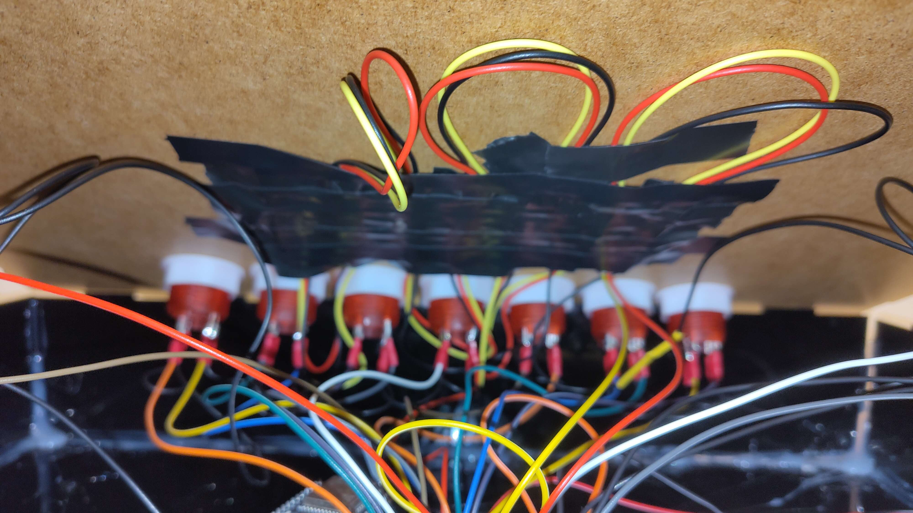
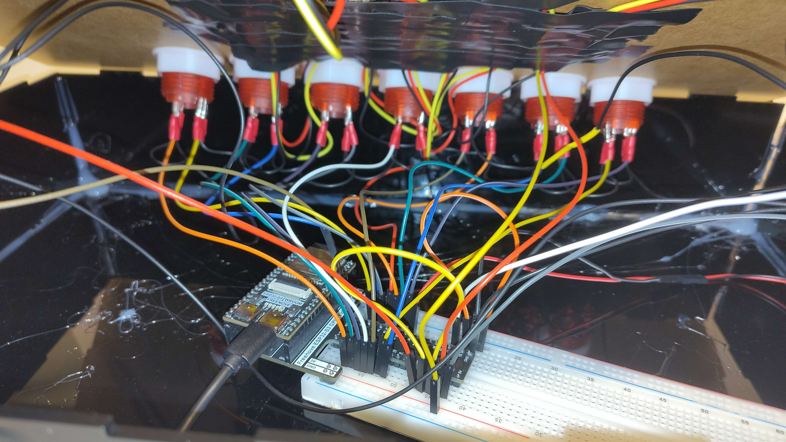
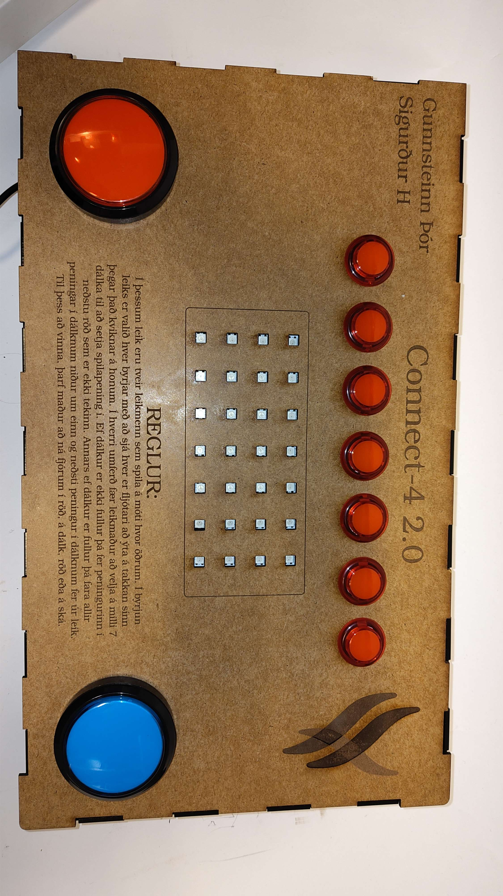

# VESM1_V6
Verkefni Í VESM1VS í Tækniskólanum 2025
## Verkefnalýsing
https://github.com/VESM1VS/AFANGI/blob/main/Verkefni/V6.md
## Höfundar
Gert af Gunnsteini Þór og Sigurð Heiðar
## Leikreglur
Í þessum leik eru tveir leikmenn sem spila á móti hvor öðrum. Í byrjun leiks er valið hver byrjar með að sjá hver er fljótari að ýta á takkan sinn þegar kviknar á honum. Í hverri umferð fær leikmaður að velja á milli 7 dálka til að setja spilapening í. Ef dálkur er ekki fullur þá fer peningurinn í neðstu röð sem er ekki tekinn. Annars ef dálkurinn er fullur þá fara allir peningar í dálknum niður um einn og neðsti peningur í dálknum fer úr leik. Til þess að vinna þarf maður 4 í röð, í dálk, röð eða á ská.
## Virkni

## Lóðun

## Kassi

## Lok fyrir leikin

## Kóði
[Kóði](main.py)
